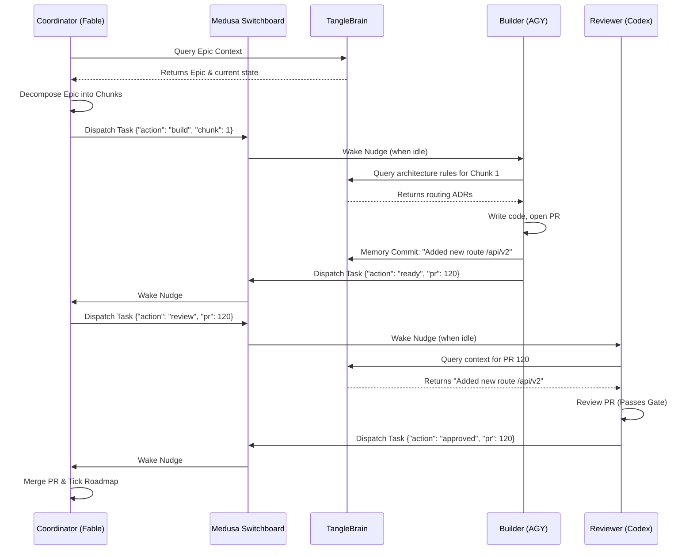

# 13. v7 Swarm Architecture & TangleBrain

Date: 2026-09-03
Status: Proposed (Vision)

## 1. Context & Motivation

TangleClaw's evolution follows a strict capability progression:
- **v5 ("The System Stops Lying"):** Single-agent pipeline reliability, deterministic idle detection (`medusaWake`), and true transport reachability.
- **v6 ("Identity & Auth"):** Multi-human access, workspace policy, and audit attribution.
- **v7 ("The Swarm"):** Autonomous heterogeneous multi-agent collaboration.

With v5 and v6 establishing a safe, reliable, and governed workspace, the system is primed for **Swarm Mode**. Currently, TangleClaw sessions operate as silos—they may broadcast "I merged this" over the Medusa Switchboard, but they do not dynamically delegate work. 

To supercharge project development, we need a coordinated multi-LLM swarm where specialized engines (Fable, AGY, Codex, Aider) tackle the tasks they are best at. However, scaling a swarm naively leads to two critical failures:
1. **Token Exhaustion:** If 5 agents all have to independently read `CHANGELOG.md` and the architecture docs, context costs multiply by O(N).
2. **Context Drift:** If the Builder updates a schema but the Reviewer doesn't know, the Swarm fights itself.

## 2. The Architecture

The v7 Swarm relies on two pillars: **Medusa** (The Nervous System) and **TangleBrain** (The Hive Mind).

### 2.1 The Nervous System: Medusa v2
The Medusa Switchboard pivots from a broadcast notification channel to a structured task-dispatch mesh.
- **Structured Payloads:** Agents send JSON task payloads rather than plain text (e.g., `{"task": "review", "pr": 1180}`).
- **Idle-Gated Delivery:** Relying on v5's `medusaWake` intelligence, Medusa guarantees that a working agent is never interrupted mid-thought. Nudges only arrive when the agent is sitting at a bare prompt.

### 2.2 The Hive Mind: TangleBrain
TangleBrain becomes the centralized semantic memory and state engine for the Swarm.
- **Memory Commits:** When an agent finishes a chunk, it pushes a "memory commit" to TangleBrain (e.g., "Updated Medusa schema to v34").
- **Targeted Context:** Agents no longer ingest the whole codebase. A newly spawned Reviewer agent queries TangleBrain for context specific to its PR, ensuring it has the exact, latest state without the overhead of full discovery.

## 3. Swarm Topology

A standard v7 deployment features heterogeneous agents fulfilling specific roles:

* **Coordinator (e.g., Fable/Opus):** Heavy reasoning. Decomposes Epics into chunks, dispatches tasks via Medusa, runs the Critic gates, and merges PRs.
* **Builder (e.g., AGY/Sonnet):** Fast, targeted execution. Receives chunk specs, authors code, and opens PRs.
* **Reviewer (e.g., Codex):** Deep analysis. Scrutinizes PRs against TangleBrain's architectural memory.
* **Researcher (e.g., Aider):** Broad context gathering. Explores external documentation or deep codebase histories to answer specific architectural questions.

## 4. Workflow Diagram

## 5. Next Steps / Consequences
- v5 and v6 development must preserve the Medusa API surface to ensure it remains a clean seam for JSON payloads.
- TangleBrain's schema needs to be formalized to accept structured "memory commits" alongside standard markdown embeddings.
